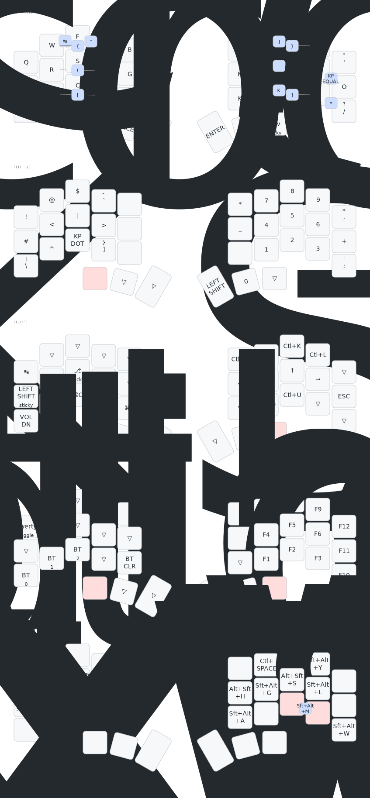

# Chocofi Temper ZMK Config

This is my personal ZMK config for the [Chocofi Temper](https://github.com/raeedcho/chocofi-temper).

Some notes about this config:
- Five layers (default, numbers/symbols, navigation, function, and macros)
- Default layer is Colemak DHm, but there's also a QWERTY layer that can be toggled on
- Navigation layer has vim-like arrow keys
- Separate macro layer for useful stuff like window manager functions

